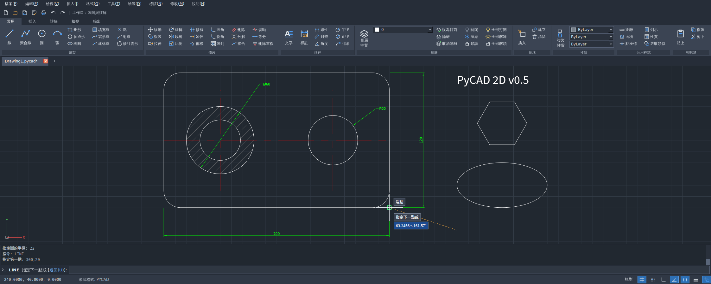

# PyCAD v0.6.9.4

PyCAD 是一個以 Python / PySide6 開發的獨立 2D/3D CAD 桌面應用程式，提供常見工程繪圖、指令列操作、DXF/DWG 工作流程、3D 基本體、STEP/STL/OBJ 等匯入匯出，以及 3D 精準定位與 Gizmo 操作。

> **專案狀態：** Alpha / 個人開源專案。請在重要工作前保留原始檔與備份；目前不建議把它當作唯一的生產環境 CAD 工具。



## v0.6.9.4 公開版重點

- 專案正式採用 **GNU General Public License v3.0 only (GPL-3.0-only)**。
- 保留 v0.6.9.3 的 Linux Mint / X11 / Wayland 主視窗 resize 修正，以及 Linux 滑鼠滾輪 / 觸控板 viewport zoom 修正。
- 保留 3D Gizmo `TAB` 精確距離輸入、WorkPlane、Boolean、STEP/STL/OBJ 與大型模型 picking/LOD 改善。

## 功能概覽

- **2D**：LINE、PLINE、CIRCLE、ARC、RECTANG、HATCH、OFFSET、TRIM、EXTEND、FILLET、CHAMFER、ARRAY、DIM 等。
- **3D**：BOX、CYLINDER、CONE、SPHERE、WEDGE、PYRAMID、TORUS、MOVE3D、PLACE3D、ROTATE3D、SCALE3D、UNION、SUBTRACT、INTERSECT、SLICE。
- **檔案**：PyCAD 原生專案、DXF；透過 ODA File Converter 可選支援 DWG；透過 CadQuery/OpenCascade 支援 STEP 與部分 3D 幾何操作；透過 trimesh 支援多種 mesh 格式。
- **精準輸入**：絕對座標、相對座標、極座標、2D 動態輸入，以及 3D Gizmo 沿 X/Y/Z 軸的 TAB 距離輸入。
- **Linux**：針對 Linux Mint XFCE / X11 / Wayland 的主視窗縮放、Ribbon 最小寬度、平滑滾動與觸控板事件做過相容性修正。

## 安裝

### Linux Mint / Ubuntu 類系統

需要 Python 3.10 以上：

```bash
chmod +x install_linux_mint.sh run.sh
./install_linux_mint.sh
./run.sh
```

也可使用 GitHub Releases 提供的 `.deb` 安裝檔。

### Windows

安裝 Python 3.10 以上後執行：

```bat
run_windows.bat
```

## Python 相依套件

核心：

```bash
pip install -r requirements.txt
```

3D / STEP / mesh 額外功能：

```bash
pip install -r requirements_3d.txt
```

主要第三方元件與授權摘要請見 [`THIRD_PARTY_NOTICES.md`](THIRD_PARTY_NOTICES.md)。本 repository 不把這些第三方 Python 套件的原始碼複製進專案；安裝腳本使用套件管理工具取得它們。

## 測試

```bash
python -m pytest -q
```

沒有 PySide6 GUI 環境時，部分 UI 測試會自動略過。

## 開源授權

PyCAD 自有原始碼以 **GNU GPL version 3 only** 授權。完整條款請見 [`LICENSE`](LICENSE)。

簡單說，你可以執行、研究、修改與再散布 PyCAD；若你散布修改後或衍生的 GPL 程式，必須依 GPLv3 提供對應原始碼與相同授權權利。真正具法律效力的內容以 `LICENSE` 原文為準。

Copyright © 2026 PyCAD contributors.

## 第三方名稱與商標

PyCAD 是獨立社群/個人開源專案，**與 Autodesk, Inc. 無隸屬、授權、贊助或背書關係**。AutoCAD、Autodesk 與相關名稱/標誌為其各自權利人的商標。專案中若提及第三方產品或格式名稱，只用於描述檔案相容性、互通性或技術背景。

DWG 支援若啟用，可能需要使用者另外安裝 ODA File Converter；該軟體不包含在本 repository 中，其授權由 Open Design Alliance 另行提供。

## 免責聲明

本軟體依 GPLv3 以「現狀」提供，不附任何擔保。CAD/幾何運算可能包含尚未發現的錯誤；使用者應自行驗證工程尺寸、加工輸出與重要檔案。

## 貢獻

歡迎 Issue、錯誤回報、測試模型與 Pull Request。開始修改前請先閱讀 [`CONTRIBUTING.md`](CONTRIBUTING.md)。

完整歷史版本記錄位於 [`docs/changelog/`](docs/changelog/)。
